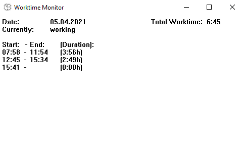

# worktime-monitor

This tool shall help users to track their working time automatically and without manual writing down of start and end times.

It uses the Windows API to retrieve information about the user activity, which is usable from Windows 2000 and above (XP, Vista, 7, 8, 10):
https://docs.microsoft.com/en-us/windows/win32/api/winuser/ns-winuser-lastinputinfo

The current state of the program looks like this:

## Usage
You can download the prebuild binary for your Platform or build the application yourself, see next chapter. It is tested only with Windows 10.

## How to build
Download MS Visual Studio 2019 and load the solution file (worktime-monitor.sln). Afterwards you can run "Build solution".

## License
worktime-monitor is licensed under the MIT license, see license file for details.
